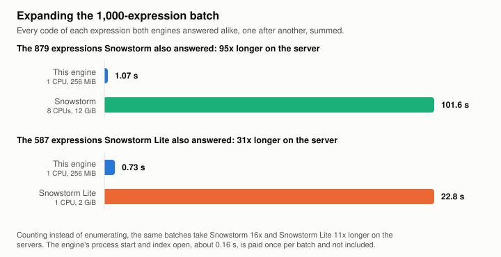
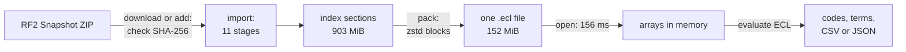

# SNOMED ECL engine

[](https://crates.io/crates/snomed-ecl-engine)
[](https://www.npmjs.com/package/snomed-ecl-engine)
[](https://github.com/EddieDavison92/snomed-ecl-engine/actions/workflows/ci.yml)
[](LICENSE)

Evaluate SNOMED CT Expression Constraint Language on your own machine. A Rust
library and CLI, with no terminology server.


- **All of ECL 2.3.** Every expression type evaluates: refinements, attribute
  groups, reverse and dotted attributes, concrete values, member and
  description filters, history supplements.
- **One file.** The UK release becomes a 152 MiB index in about two minutes.
  It opens in 156 ms and needs no network.
- **About a millisecond a query.** The median expression takes 0.86 ms to count
  and 0.94 ms to return every code, on one CPU.
- **Scriptable.** Terminal tables, CSV, JSON, and a JSONL batch mode for
  scripts and agents.

Expanding a 1,000-expression benchmark batch, against Snowstorm and Snowstorm
Lite on the same release:

<picture>
  <source media="(prefers-color-scheme: dark)" srcset="docs/images/batch-dark.svg">
  
</picture>

## Install

| With | Command |
|---|---|
| npm | `npm install --global snomed-ecl-engine`, or `npx snomed-ecl-engine` |
| Homebrew | `brew install eddiedavison92/tap/snomed-ecl-engine` |
| Shell, Linux or macOS | `curl -fsSL https://raw.githubusercontent.com/EddieDavison92/snomed-ecl-engine/main/install.sh \| sh` |
| PowerShell, Windows | `irm https://raw.githubusercontent.com/EddieDavison92/snomed-ecl-engine/main/install.ps1 \| iex` |
| Cargo | `cargo binstall snomed-ecl-engine`, or `cargo install --locked snomed-ecl-engine` |

<details>
<summary>Docker, platforms and builds</summary>

```sh
docker run --rm -v "$PWD":/data ghcr.io/eddiedavison92/snomed-ecl-engine --help
```

Executables are built for Linux (x86-64 and arm64, glibc 2.36 or later), macOS
(arm64 and x86-64) and Windows (x86-64). Each is on the
[releases](https://github.com/EddieDavison92/snomed-ecl-engine/releases) page
in up to three builds:

| Build | Size | For |
|---|---:|---|
| `query` | 2.5 MiB | Querying an existing index, packing and verifying |
| `default` | 3.3 MiB | The above, plus downloading and importing RF2 |
| `unicode` | 34.5 MiB | The above, plus term matching in description filters; Linux only |

npm, Homebrew, `cargo binstall` and the scripts install the `default` build;
the Docker image has the `unicode` build. The scripts take
`SNOMED_ECL_BUILD=query` or `unicode` to choose another. Building from source
with `--features unicode` needs ICU 72 or later (`libicu-dev` and `pkg-config`
on Debian or Ubuntu); [developer setup](docs/setup.md) covers the rest.

</details>

Release archives and the Docker image carry signed build attestations from
0.2.1 on. To check that a download was built by this repository's release
workflow:

```sh
workflow=EddieDavison92/snomed-ecl-engine/.github/workflows/release.yml
gh attestation verify snomed-ecl-engine-v0.2.1-x86_64-unknown-linux-gnu-default.tar.gz   --repo EddieDavison92/snomed-ecl-engine --signer-workflow "$workflow"
gh attestation verify oci://ghcr.io/eddiedavison92/snomed-ecl-engine:0.2.1   --repo EddieDavison92/snomed-ecl-engine --signer-workflow "$workflow"
```

npm packages carry the equivalent provenance, which `npm audit signatures`
checks.

The index format may change between releases without a migration: rebuild the
index from your RF2 archive when you upgrade.

## Quick start

You need a SNOMED CT RF2 Snapshot that you are licensed to use; see
[licence](#licence). UK Monolith is the tested edition. In the UK, register with
NHS England's [TRUD](https://isd.digital.nhs.uk/trud/), subscribe to the UK
Monolith Snapshot and copy the API key from your account page:

```sh
# Download the newest release, check it, build an index and select it.
export TRUD_API_KEY=...
snomed-ecl-engine download

snomed-ecl-engine expand '<< 195967001 |Asthma|' --count
snomed-ecl-engine search chronic kidney
snomed-ecl-engine query
```

To build from an archive you already have, give `add` the SHA-256 its
distributor published. It checks the archive before reading anything; without
`--sha256`, it shows the checksum and asks you to confirm it. A checksum of your
own download shows it is intact, not where it came from.

```sh
snomed-ecl-engine add uk_sct2mo_42.5.0_20260826000001Z.zip --sha256 SHA256_FROM_TRUD
```

`list`, `use` and `remove` manage the indexes you build, by name
(`uk-20260826`) or release (`uk@2026-08`, or `uk` for the latest).

## What you can do with it

### Expand any ECL 2.3 expression

Every kind of expression in ECL 2.3 evaluates against the real release:

| Expression | Example |
|---|---|
| Hierarchy: self, descendants, ancestors, children, parents | `<< 73211009 \|Diabetes mellitus\|`, `>! 73211009` |
| Top and bottom of a set | `!!> (<< 73211009)` |
| Conjunction, disjunction, exclusion | `<< 73211009 MINUS << 46635009 \|Type 1 diabetes mellitus\|` |
| Refinements, attribute groups, cardinality | `< 404684003 : [1..3] { 363698007 \|Finding site\| = << 39607008 }` |
| Reverse attributes | `< 105590001 \|Substance\| : R 127489000 \|Has active ingredient\| = *` |
| Dotted attributes | `< 19829001 \|Disorder of lung\| . 363698007 \|Finding site\|` |
| Concrete values, compared as exact decimals | `< 763158003 : 1142135004 >= #500` |
| Reference set membership | `^ 723264001 \|Lateralisable body structure reference set\|` |
| Concept filters | `<< 73211009 {{ C definitionStatus = defined }}` |
| Description filters: terms, types, languages, dialects | `<< 73211009 {{ D term = "type 2", dialect = en-gb (prefer) }}` |
| Member filters and field projections | `^ [targetComponentId] 900000000000527005 {{ M referencedComponentId = 397709008 }}` |
| History supplements | `<< 195967001 \|Asthma\| {{ + HISTORY-MOD }}` |
| Alternate identifiers | `scheme#code`, with [configured schemes](docs/indexes.md#alternate-identifiers) |

`expand` lists the concepts with their terms in a terminal, one code per line
when redirected, and a `code,display` table with `--csv`. Anything a build
cannot evaluate, such as a term filter without the `unicode` feature, fails
with an explicit error: no query returns a partial answer as a success.

<details>
<summary>How the ECL support is tested</summary>

- **Grammar.** A differential test generates sentences covering every
  alternative, optional part and repetition count of both official ECL 2.3
  grammars, about 35,000 samples, and leaves no unexplained disagreement. The
  two grammars define the same 180 rules, and the test exercises 179 of them.
  The remaining rule, `stringValue`, is never referenced by any other rule, so
  no expression can contain it. All 121 official syntax examples parse.
- **Answers.** Two corpora of 1,000 and 10,000 expressions across 25 categories
  return the code sets recorded for them, and scripts check result sets against
  the RF2 files directly. Of the 880 corpus expressions Snowstorm could answer,
  the two returned the same code set for 879; on the last, the RF2 rows support
  this engine's answer.
- **Undefined forms.** Three forms are valid under the grammar but have no
  defined meaning in the specification, such as a reverse flag inside an
  attribute group. The parser refuses them with a `Semantic` error rather than
  guess, and two have open questions with SNOMED International.

[ECL support](docs/ecl-support.md) has the detail. Decimals keep their exact
spelling and are never compared as binary floating point. Relationship groups
survive import. The engine reads the published inferred view and does not
classify.

</details>

### Find and describe concepts

ECL answers which concepts, never what a concept is. `search` finds concepts by
the words in their terms, `lookup` shows one concept's terms, parents,
children, attributes and reference sets, and `history` shows what replaced an
inactive concept.


A search of the whole UK edition takes under a millisecond once the word index
is loaded. Words are extracted when the index is built, so a search is a binary
search and a list intersection, with no collation library at query time.
`--within ECL` limits it to an expression's answer.

### Explore interactively

`query` opens the index once and evaluates each expression as you type it.
`:count` switches to totals only, and `:search` and `:lookup` browse without
leaving the session.


### Script it

`batch` reads one JSON request per line and answers each without reopening the
index, so one process can serve thousands of expressions, searches and lookups.
[SKILL.md](SKILL.md) takes an agent from a clone to a first query.

```sh
echo '{"ecl":"<< 195967001","count_only":true}' | snomed-ecl-engine batch uk
echo '{"search":"chronic kidney","limit":5}'    | snomed-ecl-engine batch uk
```

`diff` evaluates one expression against two indexes and reports what a new
release added and removed. After downloading a newer release, compare it, `uk`
for the latest, with the one before:

```sh
snomed-ecl-engine diff uk@2026-08 uk '<< 73211009 |Diabetes mellitus|'
```

The [CLI guide](docs/cli.md) covers every command, output format and batch
field.

### Embed it

```rust
use snomed_ecl_engine::{ecl, eval, store::NumericStore};
use std::path::Path;

let store = NumericStore::open(Path::new("data/uk.ecl"))?;
let expression = ecl::parse("<< 64572001 |Disease|")?;
let ordinals = eval::evaluate(&store, &expression)?;
let codes: Vec<u64> = ordinals.iter().map(|&o| store.ids[o as usize]).collect();
```

Open the store once and keep it for every query. Results are concept ordinals
that resolve through `store.ids`; display labels are a separate lookup through
`DisplayStore`. `eval::evaluate_result` also returns member projections, which
can be typed values or rows rather than concepts, and the `_with_limits`
variants bound the work a query may do. Build with `default-features = false`
to leave out the RF2 importer.

## Performance

Against the UK Monolith release of 26 August 2026: 1.15 million concepts.

| Measurement | This engine |
|---|---:|
| Packed index for the UK release | 152 MiB |
| Open a packed index, one CPU | 156 ms |
| Every code of the 879 corpus expressions Snowstorm also answered | 1.07 s against Snowstorm's 101.6 s |
| Median single expression, count / every code | 0.86 ms / 0.94 ms |
| 10,000-expression corpus through the CLI, one CPU | 11.5 s per batch |
| Same corpus through the library, one CPU | 2.0 s per batch |

Speed only counts if the answers match, so the corpus compares whole code sets
rather than totals. This engine returned a set for all 1,000 expressions.
Snowstorm agreed on 879, disagreed on 1, where the RF2 rows support this
engine's answer, and could not answer 120. Snowstorm Lite agreed on 587,
returned 13 wrong answers, and could not answer 400.

<picture>
  <source media="(prefers-color-scheme: dark)" srcset="docs/images/footprint-dark.svg">
  
</picture>

Counting an expression's concepts and returning every one of them cost nearly
the same, because evaluating the expression already built the set. An HTTP API
has to serialise the concepts and page them back, and that cost grows with the
answer:

<picture>
  <source media="(prefers-color-scheme: dark)" srcset="docs/images/expansion-scaling-dark.svg">
  
</picture>

That makes some jobs cheap enough to do routinely:

- **Serverless functions.** The query-only executable is 2.5 MiB, 1.1 MiB
  gzipped. Starting the process, opening the index and answering a query takes
  163 ms on one CPU.
- **A small server.** One CPU and 256 MiB serve the whole UK release for
  typical workloads; one that loads every index at once needs 320 MiB.
- **Converting code lists.** Turning static code lists into ECL definitions
  means expanding each candidate in full and diffing it against the original
  list. At about a millisecond each, hundreds of lists take under a second.
- **Testing definitions in CI.** An executable of under 3 MiB and an index file
  let a pipeline assert that every definition still resolves.

This is not a replacement for a terminology server. Snowstorm does a great deal
this engine does not; expanding ECL is the one job both do.
[Benchmarks](docs/benchmarks.md) has the method, every figure's evidence file,
the disagreements, where this engine is slower and [where the comparison is and
is not fair](docs/benchmarks.md#is-this-a-fair-comparison).

## How it works



Import reads the release once and writes each part of the index as its own
section: the hierarchy, relationships, reference set membership, descriptions,
display labels, the word index and history. Packing compresses the sections
into one file. Opening it decodes the sections a query needs into plain arrays,
so evaluation is set algebra over sorted lists of four-byte concept ordinals.

The UK release is 903 MiB as a directory of sections and 152 MiB packed:

- Concepts are four-byte ordinals from the first read on, never 18-digit codes.
- Sorted lists, such as the concepts sharing a word, store the gaps between
  values, mostly one byte each.
- Reference set rows are sorted by the component they reference, so
  neighbouring rows compress into each other. The member UUID, which ECL never
  uses, is not stored.
- Each display label is its own zstd frame against a dictionary trained on the
  labels, so reading one label is still one read.
- Sections are packed as independent zstd blocks, small for descriptions so
  describing a concept decodes only what it reads.

None of this slows queries: sections read whole decode once, and labels and
single-concept lookups still read only what they need. [How the index is
built](docs/index-format.md) explains each technique and what it saves.

## Documentation

- [CLI guide](docs/cli.md): commands, output formats and the batch protocol.
- [ECL support](docs/ecl-support.md): what evaluates, and the open questions.
- [Indexes](docs/indexes.md): building, supplements, packing, configuration.
- [How the index is built](docs/index-format.md): encodings, compression and reads.
- [Benchmarks](docs/benchmarks.md): method, results and comparisons.
- [Roadmap](docs/roadmap.md): open work.
- [Developer setup](docs/setup.md): building from source, reproducing the
  benchmarks and recording the terminal clips.
- [Contributing](CONTRIBUTING.md) and [security](SECURITY.md).

## Licence

The code is licensed under the [MIT licence](LICENSE).

SNOMED CT is not included and is licensed separately. It is owned by SNOMED
International, and you need a licence to use it: in the UK, through NHS England's
[TRUD](https://isd.digital.nhs.uk/trud/); in other member countries, through the
national release centre or [MLDS](https://mlds.ihtsdotools.org/). An index built
from a release contains SNOMED CT content, so share it only as your licence
allows. The terminal clips show a few SNOMED CT terms from the UK Monolith
release.
