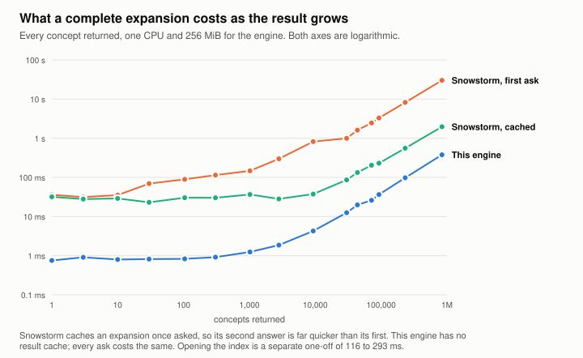

# SNOMED ECL engine

Evaluate SNOMED CT Expression Constraint Language without running a terminology
server.

Most ways to run ECL assume a server: a JVM that stays up, a search cluster
beside it, gigabytes of memory. This is a Rust library and a CLI instead. You
point it at a SNOMED release, it builds an index once, and you query that index
inside your own process.

```sh
snomed-ecl-engine use uk.ecl
snomed-ecl-engine expand '<< 195967001 |Asthma|' --display
```

## Why it is small

Underneath, evaluating ECL is set algebra over a graph that is already sitting
on your disk. Running a search cluster to do it is a lot of machinery, and the
cost of that machinery is that ECL can only live where the machinery lives.

Here, the terminology is one file and the query engine is a function call.

### What it is designed for

- **Serverless functions.** You only pay for compute when a query arrives. The
  query-only executable is 2.13 MiB, under a megabyte gzipped, and the index is
  a single file.
- **A small VPS.** One CPU and a few hundred megabytes serve the whole UK
  release, so an ECL API does not need a cluster behind it.
- **Portable devices.** The index sits beside your application and needs no
  network at query time. Built once it never changes, and it checks its own
  checksums when opened.
- **Agents and tooling.** One persistent process reads expressions as JSONL and
  answers thousands of them without reopening the index.

Everything measured here ran on x86-64 Linux.

There is no HTTP server in this repository, on purpose. This repository owns the
library, index format, importer, CLI, conformance tests and benchmarks. A
deployment application depends on it and owns the hosting.

## What it is good for

Here is the number that matters. Counting how many concepts an expression
selects takes 2.20 ms. Getting every one of those concepts back takes 2.29 ms.

Those are nearly the same, and for a reason: evaluating the expression already
built the whole set, so handing it to you is a write. An HTTP API has to
serialise those concepts and page them back, and that cost grows with the answer.

<picture>
  <source media="(prefers-color-scheme: dark)" srcset="docs/images/expansion-scaling-dark.svg">
  
</picture>

Ask for ten concepts and a terminology server is a few times slower. Ask for
839,000 and this engine takes 0.4 seconds against Snowstorm's 30 the first time,
or 2 seconds once Snowstorm has cached it. This engine has no result cache and
does not need one.

None of which is an argument for replacing a terminology server. Snowstorm does
a great deal this does not, and the only job both do is expanding ECL. Two paths
here are slower than on either server: the first description-filter query in a
process, and history supplements. Both are
[open work](docs/roadmap.md). Where the comparison is and is not fair is
[set out in full](docs/benchmarks.md#is-this-a-fair-comparison).

So expanding a definition in full stops being something you do sparingly.

- **Expand hundreds of codelists at once.** Turning a directory of static code
  lists into ECL definitions means expanding every one in full and diffing it
  against the original. At about 2 ms each, 274 lists take under a second.
- **Check a codelist against a new release.** `diff` runs one expression across
  two indexes and tells you what the release added and removed.
- **Put it in CI.** A two-megabyte binary and an index file let a pipeline
  assert that every definition in your repository still resolves.

### Authoring with an assistant

Today, giving someone ECL means provisioning a terminology server account or
issuing them an API key. Here you install one binary and point it at a release
you are already licensed for. Nothing to host, no key to issue, no rate limit
and nobody to ask. An agent can do the setup for you: [SKILL.md](SKILL.md) takes
it from a clone to a working index and a first query.

That is what makes interactive terminology work practical. Replacing a static
code list with an ECL definition means walking up the hierarchy from every code
in it, sizing each ancestor that could subsume them, then comparing what each
candidate returns against the list you started with. A five-code list takes about
thirty expansions and a hundred-code list about five hundred, so an assistant can
propose a definition, show you exactly which concepts it adds and drops, and try
another, in about a second.

## Measurements

Against the UK Monolith release, 1.15 million concepts.

<picture>
  <source media="(prefers-color-scheme: dark)" srcset="docs/images/footprint-dark.svg">
  
</picture>

Speed only counts if the answers match, so the corpus compares complete code
sets rather than totals. This engine evaluated all 1,000 expressions and
returned a complete set for every one. Snowstorm answered 879 and agreed on all
879; its parser rejected 80, its concept endpoint could not return 40, and it
answered 1 differently, where the RF2 rows support our answer. Snowstorm Lite
answered 587 and reported 320 as using features it does not implement.

| | |
|---|---:|
| Query-only Linux executable | 2.13 MiB (0.91 MiB gzipped) |
| 10,000-expression corpus, one CPU and 256 MiB | 35.05 s per warm batch |
| Same corpus, four CPUs and four workers | 5.87 s |
| Open a packed index | 177 ms |
| Open an uncompressed index | 94 ms |

[Benchmarks](docs/benchmarks.md) has the method, the disagreements, where this
engine is slower and what these numbers are not.

## What it supports

Every ECL 2.3 feature area: hierarchy and Boolean sets, refinements, groups and
cardinalities, reverse and dotted attributes, exact concrete comparisons, top
and bottom, membership, concept filters, description filters, member filters and
projections, history supplements and alternate identifiers.

Three forms are valid under the grammar but have no clear meaning in the
specification, so the parser refuses them rather than guess:

- a reverse flag inside an attribute group, `* : { R 363698007 = X }`
- a member filter with no refset operator, `X {{ M active = true }}`
- a reverse flag applied to a concrete value

Two of those have questions open with SNOMED International, still unanswered.
Everything else in ECL 2.3 evaluates. Unsupported input fails with an explicit
error, and no query ever hands you a partial answer as though it were complete.

Decimals keep their exact spelling, and the evaluator never compares them as
binary floating point. Relationship groups survive import. The engine reads the
published inferred view and does not classify.

## Get started

```sh
cargo build --locked --release --bin snomed-ecl-engine

# What does this archive declare? Prints the import command for it.
snomed-ecl-engine inspect uk_release.zip

# Build an immutable index, then keep it in one compressed file.
snomed-ecl-engine import uk_release.zip index/ EDITION_URI SHA256
snomed-ecl-engine pack index/ uk.ecl

# Choose it once; later commands need no path.
snomed-ecl-engine use uk.ecl
snomed-ecl-engine query
```

Bring your own licensed RF2 Snapshot. This repository contains no release
content, and `import` verifies the checksum you supply before reading anything.

| Command | |
|---|---|
| `inspect` | Read an archive's release metadata and print its import command |
| `import` · `add-refsets` | Build an index; add simple refsets such as UK PCD |
| `pack` · `verify` | One compressed file; check every section |
| `stores` · `use` · `stats` | Find indexes, select one, inspect it |
| `query` | Evaluate expressions against one open index |
| `expand` · `batch` | One expression; or JSONL on stdin for scripts and agents |
| `diff` | Compare one expression across two indexes |

The [CLI guide](docs/cli.md) is the full reference.

## Embed it

```rust
let store = NumericStore::open(Path::new("uk.ecl"))?;
let expression = ecl::parse("<< 64572001 |Disease|")?;
let ordinals = eval::evaluate_with_limits(&store, &expression, limits)?;
let codes = ordinals.iter().map(|&o| store.ids[o as usize]);
```

Keep the store open across queries. Results are concept ordinals that resolve
through `store.ids`, and display labels are a separate lookup. Use
`eval::evaluate_result_with_limits` if you want member projections, which return
typed scalars or rows as well as concept sets. `--no-default-features` drops the
ZIP importer for a query-only build.

## Documentation

- [CLI guide](docs/cli.md) covers commands, output formats and scripting.
- [ECL support](docs/ecl-support.md) lists what evaluates and the open questions.
- [Indexes](docs/indexes.md) covers building, packing, the format and configuration.
- [Benchmarks](docs/benchmarks.md) has the method, results and comparisons.
- [Roadmap](docs/roadmap.md) lists the open work.
- [Developer setup](docs/setup.md) covers building, releases and comparison servers.
- [SKILL.md](SKILL.md) is the agent workflow.
