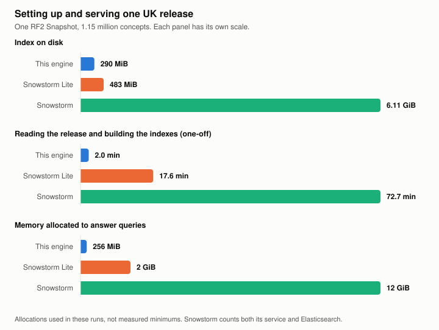
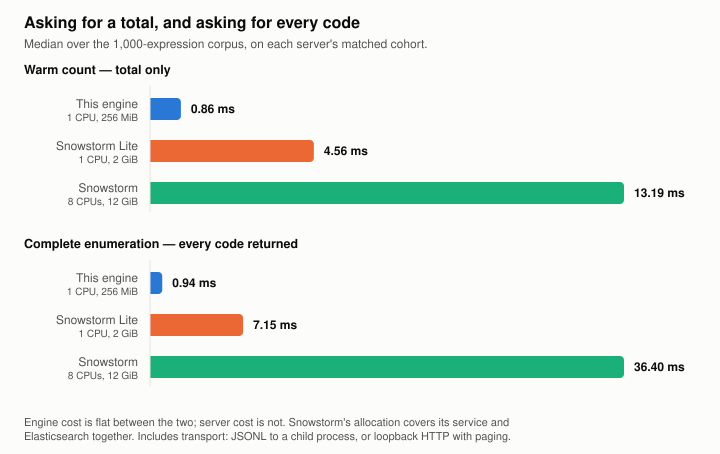

# Benchmarks

These pages measure two workloads separately, because their costs differ.

**Counting** asks for the size of a result. Snowstorm answers with the total and
at most one concept identifier.

**Enumerating** asks for every concept in the result, which is what building a
codelist, an export or a value set needs. Snowstorm returns those concepts in
pages of up to 10,000, so a 65,000-concept result costs seven HTTP round trips
and 65,000 serialised entries. This engine returns the set from memory in one
response.

The two cost this engine 2.20 ms and 2.29 ms. They cost Snowstorm 13.19 ms and
36.40 ms. Quoting a count latency for an enumeration workload would understate
Snowstorm's by a factor of three, so the tables below keep them apart.

## Is this a fair comparison?

Partly, and it is worth being precise about which parts.

**What is fair.** Both engines answer the same expressions against the same
release, gated by four checks before any timing runs: the store manifest and the
recorded import agree on edition and archive checksum, the server advertises
that edition, its branch head is unchanged since the import completed, and two
sentinel queries return exact expected counts. Only expressions where both
returned identical complete code sets receive paired timings. Snowstorm is asked
for its cheapest form, `returnIdOnly=true`, at its own maximum page size of
10,000, using cursor pagination rather than deep offsets. It also had eight CPUs
and 12 GiB against this engine's one CPU and 256 MiB.

**What is not.** Three things.

*Transport is included and is not symmetric.* This engine hands a result to a
parent process over a pipe. Snowstorm serialises JSON and returns it in pages
over HTTP. Much of the difference on large results is serialisation and round
trips, not evaluation. That is a fair measure of what it costs to get a complete
code set out of each system, which is the question here, but it is not a measure
of whose set algebra is faster. HTTP is Snowstorm's only interface, so there is
no version of this comparison without it.

*The corpus is ours.* The multiples above are a property of this workload. The
1,000-expression corpus and the 10,000-expression corpus have the same median
result size, one concept, and differ almost entirely in the tail: two results
over 50,000 concepts against 107. That tail is what moves the ratio. On a
workload of mostly small expansions the gap is closer to the count figure.

*The products are not equivalent.* Snowstorm is a terminology server with
search, FHIR endpoints, branch management, authoring and multiple versions
loaded at once. This engine evaluates ECL against one fixed release. Being
faster at that one operation is not being better.

**What is untested.** Every measurement here is a single sequential client.
Snowstorm's extra CPUs would matter under concurrent load; this engine's CLI is
sequential and would not use them. Neither side has been measured under
concurrency.

## Setting up and serving one release

<picture>
  <source media="(prefers-color-scheme: dark)" srcset="images/footprint-dark.svg">
  
</picture>

| | This engine | Snowstorm Lite 2.7.0 | Snowstorm 11.0.0 |
|---|---:|---:|---:|
| Index on disk | 290 MiB packed | 483 MiB | 6.11 GiB Elasticsearch |
| Read the release and build the indexes | 120 s | 1,057 s | 4,360 s |
| Memory allocated to answer queries | 256 MiB | 2 GiB | 12 GiB (two services) |
| Architecture | Rust library or CLI | Java service with Lucene | Java service plus Elasticsearch |

Reading the release happens once, before any query, and produces an index that
never changes. Allocations are what each run was given, not measured minimums. Snowstorm's
figure counts its own service and Elasticsearch together. Index contents are not
identical: ours holds descriptions, displays and typed member tables; the servers
hold their own search structures.

## Counting and enumerating

<picture>
  <source media="(prefers-color-scheme: dark)" srcset="images/latency-dark.svg">
  
</picture>

The 1,000-expression corpus, each server compared on its own matched cohort.
The engine ran on one CPU and 256 MiB, Snowstorm Lite on one CPU and 2 GiB, and
Snowstorm on eight CPUs and 12 GiB across its service and Elasticsearch:

| | Engine median | Engine p95 | Server median | Server p95 |
|---|---:|---:|---:|---:|
| Snowstorm, warm count | 2.20 ms | 9.97 ms | 13.19 ms | 41.63 ms |
| Snowstorm, complete enumeration | 2.29 ms | 11.45 ms | 36.40 ms | 98.18 ms |
| Lite, warm count | 2.22 ms | 13.94 ms | 4.56 ms | 35.40 ms |
| Lite, complete enumeration | 2.34 ms | 15.95 ms | 7.15 ms | 58.24 ms |

As ratios, comparing medians on each matched cohort:

| | Count | Complete enumeration |
|---|---:|---:|
| Faster than Snowstorm by | 6.0x | 15.9x |
| Faster than Snowstorm Lite by | 2.1x | 3.1x |

Summed over a whole cohort rather than per expression, enumeration is 11.3x
against Snowstorm and 10.8x against Lite. The per-expression median and the
cohort total differ because the total is dominated by the largest results.

The engine's cost moves from 2.20 ms to 2.29 ms between counting and
enumerating, because evaluating the expression already built the whole set.
Both servers roughly triple. Over the matched cohort that is 9.0 s
against 101.6 s for Snowstorm, and 2.1 s against 22.8 s for Lite.

Timings include transport: JSONL to a child process for the engine, loopback
HTTP with paging for the servers. Five seeded shuffled batches, no result cache,
caches not dropped. p95 describes this corpus, not a general workload.

### The 10,000-expression corpus

The broader [10,000-expression corpus](../validation/ecl-10000.json) contains
expressions whose results run to hundreds of thousands of concepts. Paging one of
those out of Snowstorm takes minutes, and a full comparison run over all 10,000
has never finished. The engine evaluates the same corpus in 35.05 s per warm
batch on one CPU and 256 MiB.

Snowstorm is not slow at the work it is built for; its count latency above is
13.19 ms. The cost here is HTTP pagination and JSON serialisation of very large
result sets, repeated thousands of times.

## How much of the language each engine ran

Same 1,000 expressions:

| Outcome | vs Snowstorm | vs Lite |
|---|---:|---:|
| Complete code sets match | **879** | **587** |
| Server declares the feature unsupported | 0 | 320 |
| Server's parser rejects the expression | 120 | 80 |
| Complete sets disagree | 1 | 13 |

Snowstorm Lite reports unsupported features honestly, answering HTTP 501
`not-supported` and saying which feature: attribute group (80), concept filter
(40), description filter (40), member filter (40), attribute cardinality (40),
reverse flag (40), and concrete value comparison operators (40). Snowstorm's 120
are its parser rejecting ECL 2.3 top and bottom at the first `!`, plus
member-field projections its concept endpoint cannot return.

### Where this engine is slower

Snowstorm enumerated faster on 2 of the 879, and Lite on 37 of its 587. Two
paths account for nearly all of it.

**The first description-filter query in a process.** It loads the description
index, and that cost lands on whichever query arrives first: 5,940 ms for the
slowest case here. Across all 40 description-filter expressions the median
first run was 1.24 ms and the median warm request 1.13 ms, so this is one load
rather than a per-query cost. It matters most in a serverless function, where
every invocation is a new process.

**History supplements.** These ran at a 15.65 ms median cold and 16.10 ms warm,
so loading is not the cause. Evaluating one scans reference set member rows.
Lite answered the same expressions in about 4 ms.

Both are recorded in the [roadmap](roadmap.md).

### The disagreements

Against Snowstorm, one: `(<< 377442002) : 1142138002 != #10`. The RF2 concrete
relationship rows settle it. The concept has two active values for attribute
1142138002 in this release:

```text
active=1  group=1  value=#20
active=1  group=2  value=#10
```

One of those is not 10, so the concept satisfies `!= #10`. We return it, and
OneLondon's Ontoserver returns it, with the same result for `= #10` and `> #10`
because a different row satisfies each. Snowstorm returns an empty set, which
reads the test as "has no value equal to 10" rather than "has a value that is
not 10". The probe is recorded in
[`ontoserver-concrete-inequality.json`](../validation/ontoserver-concrete-inequality.json).

Against Lite, thirteen, all attribute inequality refinements of the form
`X : attribute != value`. Lite returns an empty set for each. Snowstorm agrees
with this engine on all thirteen, including cases with 477 and 123 concepts, so
these are answers Lite gets wrong rather than a semantic disagreement. It also
returns them as success rather than the 501 it uses for features it does not
implement. This applies to the pinned version tested.

## Engine-only measurements

No comparison server involved.

| Workload | Result |
|---|---:|
| 10,000-expression corpus, one CPU and 256 MiB | 35.05 s per warm batch, 1.75 ms median request |
| Same corpus, four CPUs and four library workers | 5.87 s, 0.95 ms median query |
| Query-only executable, `--no-default-features` | 2,231,176 B (2.13 MiB), 955,586 B gzipped |
| Default build, with the RF2 importer | 2,973,128 B (2.84 MiB), 1,290,251 B gzipped |
| With `--features unicode` for term matching | 35,731,536 B (34.08 MiB), 14,106,938 B gzipped |
| Open a packed index | 525 ms |
| Open an uncompressed index | 285 ms |
| Process start, open and answer one query | 650 ms |

## Starting cold

Opening an index is the cost a serverless invocation pays before it can answer
anything. `examples/open_breakdown.rs` splits it, on one CPU with the index on a
local filesystem:

| Phase | Uncompressed | Packed |
|---|---:|---:|
| Read and decode the core | 145 ms | 460 ms |
| Verify the core checksum | 47 ms | included above |
| Structural validation | 88 ms | 100 ms |
| **Total** | **285 ms** | **525 ms** |

The packed layout costs about 240 ms more to open, because zstd decodes 21.8 MiB
into the 86 MiB core. It is 290 MiB on disk against 1.08 GiB. Which way that
trades depends on whether the file is already local or downloaded per cold start.

Process start, opening a packed index and answering one hierarchy query takes
650 ms inside a running container. Creating the container is the platform's
cost, not the engine's: an empty `docker run` on this host takes 1,045 ms, so
end-to-end here is about 1.5 s. That figure describes Docker Desktop on Windows
and says nothing about a Linux serverless host.

Measure with the index on a local filesystem. A Windows bind mount reads at
181 MB/s against 5.6 GB/s for the container's own filesystem, which dominates
every figure above.

[Bringing this down](roadmap.md#now) is open work.

## Executable size

Statically linking ICU4C costs about 31 MiB of executable. Only description term
predicates need it. Metadata-only description filters and every other feature
work in the 2.8 MiB build.

The concurrency figure shares one index across four workers under a 1 GiB limit
with a 297 MiB charged peak; every complete result set matched. Those are direct
library timings without transport. The CLI is sequential.

## Reproducing

```sh
python scripts/benchmark_corpus.py --output OUT.json \
  --corpus validation/ecl-1000.json \
  --store-directory data/compact-store/v1-ecl-completion \
  --snowstorm http://127.0.0.1:18082 --import-report validation/snowstorm-import-evidence.json
python scripts/benchmark_corpus.py --output OUT.json \
  --corpus validation/ecl-1000.json \
  --store-directory data/compact-store/v1-ecl-completion \
  --lite http://127.0.0.1:18081/fhir
```

One server per run: running both at once distorts the timings, and the harness
refuses it. Starting the containers is in [developer setup](setup.md#comparison-servers).

The harness pins the release, executable, resource limits and complete result
digests, and will not compare unless the server advertises the same edition and
passes two release sentinels. A query only receives paired timings when both
engines returned the same complete code set. Unsupported features, parser
rejections and mismatches are recorded separately and never counted as speed.

Charts are generated by `scripts/make_charts.py` from the values in this page.

## What these numbers are not

They are fixed workloads on one host, not a conformance score and not a
general-purpose ranking. Comparison servers were given their own containers and
their default caches. Index contents differ. Nothing here measures a cloud cold
start, object-storage download, or the memory a full-language workload needs
with every semantic index resident. That last one is open work in the
[roadmap](roadmap.md).
