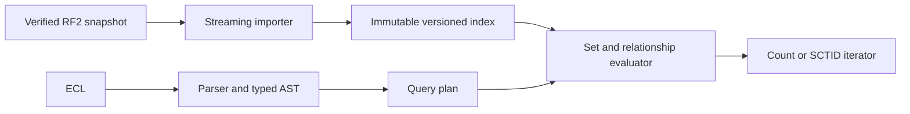

# Core engine plan

## Decision

Build an embedded Rust query engine for one immutable, versioned RF2 snapshot. Start with a library and a CLI that imports, inspects, counts and expands ECL. Keep query execution independent of storage construction and any future HTTP service. A separate application repository must own the HTTP wrapper, authentication, index delivery and deployment configuration; it consumes this library as a dependency.

Full ECL 2.3 syntax and semantics are a core acceptance requirement. Partial implementations are development milestones, not the finished engine. Compact storage must accommodate the data needed by the complete language; low resource use cannot justify omitted operators or altered results.

Serverless execution is also a design requirement. The query library must not require continuously running compute, Redis or a database service. Offline import can have a larger footprint. Keep importer dependencies separable from the runtime and produce immutable versioned indexes. The separate application handles external storage, build-time bundling or startup acquisition, and warm-instance reuse. Measure the query package size, cold index acquisition/open time, peak memory and warm execution separately. Vercel is the preferred host for that application. Object-storage latency, local disk and memory limits must inform its packaging; the current resident-store measurements do not prove suitable cold-start behaviour.

The proposed advantage is low memory use and predictable query latency on UK-scale data. Neither is proven yet. The first implementation milestone must measure the alternatives before we commit to a storage format.

## Boundaries

Use the published inferred relationship view. Preserve inactive concepts and relevant metadata for later filters and history support, but follow the specification's active-component defaults for ordinary evaluation. Make the edition, module dependencies, relationship view and supported ECL capabilities inspectable.

Initially exclude authoring, OWL classification, postcoordinated expression reasoning, multi-edition serving, incremental updates, FHIR, authentication, deployment and general free-text search. Description search required by ECL is a later engine capability, not a reason to build a terminology browser now.

Implement the official ECL 2.3 brief and long syntaxes in stages. Completion requires every grammar production and semantic rule to have implementation and conformance evidence. During development, syntactically valid but unsupported features must produce a specific error. An unsupported-feature error does not satisfy final acceptance.

## Proposed design

Start with one library crate with modules for RF2, storage, parsing and evaluation, plus one CLI binary. Split crates only when there is a concrete dependency or reuse benefit. The storage prototype pins Rust 1.93.1 and is validated on Linux.

Polish the command interface first; defer a full-screen workbench. Keep terminal presentation in the binary, preserve script output and document the clone/import/query workflow in the repository `SKILL.md`. Agents use the CLI or persistent JSONL batch process without an MCP server.

Represent external SCTIDs as `u64` internally and decimal strings at JSON boundaries. Map concepts to dense `u32` ordinals for indexes. Never use a raw SCTID as a bitmap position or assume it fits in a JavaScript number.

Store compact parent and child adjacency arrays. Compare three hierarchy strategies on the real snapshot: traversal with bounded caching, precomputed compressed descendant sets, and a hybrid that precomputes broad or frequently used sets. Measure total index size, load time, page faults and query latency. Avoid building every pair in transitive closure without measuring the cost.

Use Roaring bitmaps as the first candidate for set operations, with sorted integer vectors as a baseline. Keep relationship rows grouped by source concept, retaining `relationshipGroup`, type and destination. Add attribute/type/value candidate indexes only where benchmarks justify them. Candidate selection narrows the search; exact row and group evaluation decides the answer.

Keep concrete numbers as exact decimal values with explicit sign and scale. Keep string values separate from concept destinations. Load the concrete relationship snapshot as well as the ordinary relationship snapshot.

Refset membership needs typed handling. A language refset can reference descriptions, not concepts. Do not blindly turn every `referencedComponentId` into a concept result. Keep the original component type and the metadata needed for later member filters and projections.

Build indexes offline into a new directory, verify them, then open them read-only. Include a format version, archive checksum, edition URI, module dependency versions, section lengths and checksums. Validate offsets and lengths on load. Begin with safe buffered reads; compare memory mapping once a stable layout exists. Memory mapping alone does not guarantee low memory use.

Evaluate constant subexpressions once per query. Intersect selective candidates early, preserve exclusion order and retain exact semantics for nested refinements. Bound nesting, intermediate allocations and execution work. Cancellation or exhausted limits must return an error, never truncated success. Avoid an unbounded result cache.

## Stages and acceptance criteria

| Stage | Work | Evidence required to move on |
|---|---|---|
| 0. Preparation | Pin release, references, grammar and comparison servers | Verified archive, inventory, version-pinned OneLondon results, local baseline attempt |
| 1. Import and storage experiment | Stream the snapshot, validate dependencies and graph, compare adjacency and bitmap layouts | Reproducible component counts; no dangling required references or unexplained cycles; measured peak memory and index sizes |
| 2. Basic ECL | Literals, wildcard, all eight hierarchy operators, parentheses, conjunction, disjunction and exclusion | Official syntax examples, synthetic semantics, exact release-matched result sets and first comparative timings |
| 3. Membership and refinement | Concept refsets, nested attribute names/values, comparison, attribute cardinality, groups, group cardinality, reverse and dotted attributes, concrete values | Adversarial fixtures plus exact comparisons against a server that supports each feature |
| 4. Extended ECL | Concept, description and member filters, language/dialect policy, history supplements, member field projections and remaining 2.3 operators | Explicit capability matrix; normative examples; independently checked result types and defaults |
| 5. Resource reduction | Persistent format, startup, allocation reduction, concurrency and bounded caches | Correctness corpus unchanged; reproducible measurements on a constrained Linux runtime |

Stage 3 is an internal development milestone. Stage 4 is mandatory for the first complete engine release. Member field projection may return values other than concept IDs, so the API must preserve those result types. Final acceptance also requires the resource measurements in stage 5 against the complete implementation and full conformance corpus.

Maintain a production-by-production conformance matrix against the pinned official grammar and prose. Record parsing, evaluation, required RF2 data, synthetic edge cases and external comparisons for every feature. Include hierarchy and Boolean operations, top/bottom, alternate identifiers, nested refinements, cardinalities and groups, reverse and dotted attributes, concrete values including Booleans, refset membership and containing-any, concept/description/member filters, dialect and acceptability rules, history supplements and member projections. A feature missing from a comparison server still requires specification-based tests. Completion means no unexplained conformance failures or unsupported standard features.

Plan the remaining data alongside their operators: complete descriptions and language memberships for description filters; typed refset rows and fields for membership, filtering and projections; historical association data for history supplements; and alternate identifiers with configured scheme aliases. Preferred displays remain a separate optional lookup. These semantic indexes belong to the full engine even when a query does not need to load them.

The inventoried release has 838,955 active concepts, 4,568,005 active ordinary relationships and 320,982 active concrete relationships. These file counts set the first realistic scale for stage 1; validate component uniqueness and relationship characteristics before treating them as graph counts. See [preparation results](baseline-status.md).

## Correctness strategy

Use the official grammar and prose together. Mixed boolean operators require the parentheses prescribed by the grammar; do not invent SQL-like precedence. Compare the ANTLR and ABNF forms when filter productions overlap.

Create small synthetic RF2 fixtures for a diamond hierarchy, an inactive concept, absent attributes, multiple values, repeated groups, cross-group false matches, group zero, zero and bounded cardinality, inequality versus absence, decimal comparisons, inactive refset members and description-referencing refsets. Add deterministic generated graph tests for set identities and hierarchy inversion.

Keep a deliberately simple evaluator in the test code. Compare optimised answers with that evaluator before comparing with external servers. Check all result IDs and both set differences. Matching totals are insufficient.

Use OneLondon only for modest correctness requests. Pin `http://snomed.info/sct/83821000000107/version/20260826`, verify the returned edition, page to completion, deduplicate and compare numeric-sorted code sets. Do not stress-test a shared server. Use local Snowstorm for timing and unsupported-in-Lite semantics. If two servers disagree, reduce the query to a fixture and resolve it against the standard.

## Initial performance goals

These are design goals, not measured claims. Aim to serve the core query suite with one CPU and at most 512 MiB total memory; treat 256 MiB as a stretch goal. Aim for warm p95 below 10 ms for hierarchy/set operations and below 50 ms for representative refinements, measured inside the engine. Time complete enumeration separately from count-only operations.

Allow a larger offline build budget and measure it separately. Do not promise a fixed import memory limit before stage 1. Compare with local Snowstorm Lite and full Snowstorm at the same release and equal output work. Report timeouts and out-of-memory failures rather than removing inconvenient queries.

## Reuse decision

Evaluate `snomed-rust` RF2 types and parsing as a possible dependency after a focused compatibility test. Its current store/evaluator uses hash-based collections and has behaviour that needs checking against active-component defaults. It is not yet a dependency.

Use `sct`, Hermes and Snowstorm to study implementation choices and test cases. Keep the engine's code original until any code reuse and licence choice are deliberate. No open-source licence has been chosen for this private project.

The [compact store prototype](compact-store.md) implements numeric adjacency arrays, grouped relationship storage and separate display lookup. The [basic ECL milestone](basic-ecl.md) adds parsing, sorted-vector evaluation and release-matched comparisons. Bitmap experiments and a full module dependency resolver remain open. Next, implement membership and refinements against the [full conformance checklist](conformance.md), then use those workloads to guide further compression.
